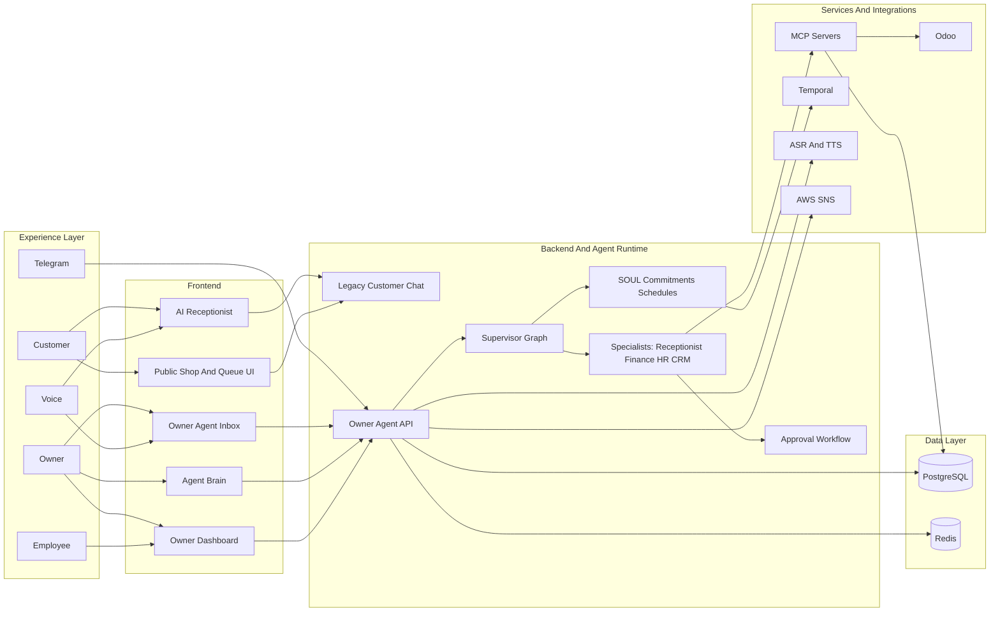

# ZeroQwait Architecture Case Study

This page is written as a public-facing architecture case study. It is intended for portfolio reviews, interviews, technical presentations, and stakeholder walkthroughs.

## One-Line Summary

I architected and built ZeroQwait as an AI operations platform for service businesses, combining conversational UX, multi-agent orchestration, Human-in-the-Loop approvals, voice infrastructure, multi-tenant data boundaries, workflow persistence, and production deployment on Kubernetes.

## The Problem

Most service businesses still operate through fragmented tools and manual coordination:

- customers need fast answers about services, availability, wait times, and bookings
- owners need real-time operational visibility without living inside multiple dashboards
- business actions such as queue changes, staffing decisions, and financial lookups span several systems and roles
- high-impact actions require control, traceability, and the ability to pause for approval

The product challenge was not just to add chat. It was to design a system where AI could safely participate in daily operations.

## Product Thesis

ZeroQwait is based on a simple product thesis:

> the owner should supervise an AI team, not manually execute every operational task.

That means the platform must do more than generate text. It needs to:

- understand intent across multiple operational domains
- route work to the right specialist capability
- execute business actions through controlled tool boundaries
- preserve state across approval pauses and resumptions
- stay tenant-safe in a multi-shop environment
- support natural interfaces such as voice, chat, inbox workflows, and notifications

## What I Architected

### 1. Dual Interaction Model

I separated the product into two different AI experiences:

- a customer-facing receptionist experience for discovery, booking, queueing, and voice interaction
- an owner-facing operations workspace powered by a supervisor agent and specialist agents

This avoided collapsing two very different user problems into one overloaded prompt and one overloaded UI.

### 2. Agent-Orchestrated Owner Workspace

The owner-facing system uses a LangGraph supervisor to coordinate specialist execution across:

- receptionist workflows
- finance and analytics
- HR and staffing
- CRM and ERP operations through Odoo

The architectural value here is not the presence of multiple agents by itself. The value is that routing, specialist execution, approvals, and persistence are explicit runtime concerns instead of being hidden inside prompt text.

### 3. Human-In-The-Loop Control Plane

High-impact actions are not executed as blind tool calls. They pause at a checkpoint, surface an approval event in the UI, and resume only after an explicit owner decision.

That design gives the platform three important properties:

- operational safety
- auditability
- resumability after interruptions or long-running decisions

### 4. Tool-Server Boundaries

I separated domain actions behind MCP servers and integration layers rather than letting agents talk directly to raw database logic everywhere.

This created a cleaner architecture for:

- queue and appointment operations
- finance queries and summaries
- HR and scheduling workflows
- Odoo-backed CRM operations
- voice and database utility services

That boundary matters because it makes the business actions testable, replaceable, and easier to reason about than prompt-defined tool behavior embedded deep inside agent code.

### 5. Persistent Operational Memory And Workflow Layer

The platform includes a durable operational brain layer:

- SOUL for business personality and learned patterns
- commitment tracking for follow-through on owner promises made in chat
- natural-language schedule creation for recurring operational tasks
- Temporal-backed execution for delayed, scheduled, and repeatable work

This shifts the system from reactive chat into ongoing operational assistance.

### 6. Voice As A First-Class Surface

Voice is not implemented as a browser-only gimmick. I designed a dedicated voice path with:

- browser recording and playback
- Whisper ASR for transcription
- Qwen3-TTS for synthesized responses
- synchronized sentence-level streaming so audio and text progress together

This keeps the conversational product experience consistent across text and voice modes.

### 7. Multi-Tenant Isolation Strategy

The platform is designed around shop-scoped isolation:

- tenant identity is injected at entry
- state and checkpoints remain scoped per shop and user
- tool execution is tenant-aware
- the approved next-stage runtime model supports free-tier shared compute and premium dedicated compute without splitting the codebase

This is one of the most important architecture decisions in the project because it allows the product to grow from a single shared runtime into stronger isolation tiers without rewriting the agent system.

## Architecture In One View

## Why This Architecture Is Strong Portfolio Material

This project demonstrates more than basic full-stack development.

### AI Systems Design

- graph-based orchestration instead of prompt-only chat flows
- specialist routing and controlled tool execution
- checkpointed multi-step execution with resumable state

### Product Architecture

- clear separation between customer experience and owner operations workflow
- natural interface support across chat, voice, approvals, feed updates, and notifications
- UI surfaces that match the underlying execution model

### Platform Engineering

- PostgreSQL, Redis, Temporal, MCP services, and external integrations
- production deployment on K3s with ingress and service boundaries
- local Compose workflow for fast non-prod validation

### Operational Safety

- Human-in-the-Loop checkpoints
- tenant-aware state injection and scoped execution
- externalized tool boundaries instead of unconstrained agent writes

## Business Outcomes Enabled

I am intentionally describing outcomes in terms of capability and business effect rather than unverified vanity metrics.

The architecture enables:

- customers to discover services, ask questions, and enter queues without waiting for staff attention
- owners to manage operations through one AI workspace rather than jumping between disconnected tools
- approval-based execution for changes that should remain under business control
- operational continuity through reminders, commitments, recurring schedules, and workflow persistence
- a credible path from shared multi-tenant runtime to stronger premium isolation without a platform rewrite

## Technical Depth Delivered

This system already includes work across:

- React and TypeScript frontend architecture
- streamed interfaces and real-time UX patterns
- FastAPI backend design
- LangGraph state machines and checkpointing
- Temporal workflow orchestration
- PostgreSQL and Redis-backed state management
- Odoo ERP integration
- Whisper and Qwen-based voice services
- SMS notification integration through AWS SNS
- Kubernetes deployment and deployment automation

## Key Design Decisions And Tradeoffs

| Decision | Reasoning | Tradeoff |
| --- | --- | --- |
| Keep customer chat and owner agent runtime separate during transition | protect public UX while owner platform matures | temporary coexistence of legacy and newer flows |
| Use LangGraph for owner flows | checkpointing, graph control, approvals, resumability | more explicit architecture than a simple chat endpoint |
| Put domain actions behind MCP services | cleaner tool boundaries and better testability | additional service surfaces to operate |
| Use Temporal for recurring operational work | durable scheduled and asynchronous execution | more infrastructure than cron-style scripts |
| Keep voice as dedicated services | better scaling and cleaner responsibility boundaries | more moving parts than browser-only speech |
| Design for tenant isolation early | avoids later platform rewrites | requires more deliberate state and routing design |

## Scope Already Implemented

### User-facing capabilities

- landing-page AI receptionist
- public booking and queue flows
- owner chat inbox with approvals and feed
- agent brain visualization
- voice interactions

### Platform capabilities

- specialist agent routing
- CRM integration
- workflow checkpoints
- commitments and schedules
- Telegram notifications and interaction path
- SMS notification service

### Deployment capabilities

- local single-stack Compose workflow
- production K3s deployment model
- GitHub Actions driven delivery

## What Makes The System Architecturally Interesting

The most interesting part of ZeroQwait is that it sits at the intersection of product architecture and systems architecture.

It is not just a web app, and it is not just an AI demo.

It is a system where:

- conversational interfaces trigger operational workflows
- those workflows are stateful, interruptible, and resumable
- AI reasoning is constrained by explicit business execution boundaries
- infrastructure supports both present-day delivery and future tier isolation

That combination is what makes it strong portfolio material.

## Suggested Companion Pages

- [TECHNICAL_ARCHITECTURE.md](TECHNICAL_ARCHITECTURE.md)
- [PORTFOLIO_DIAGRAMS.md](PORTFOLIO_DIAGRAMS.md)
