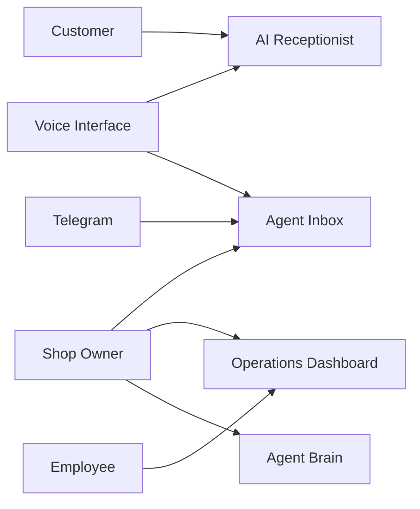
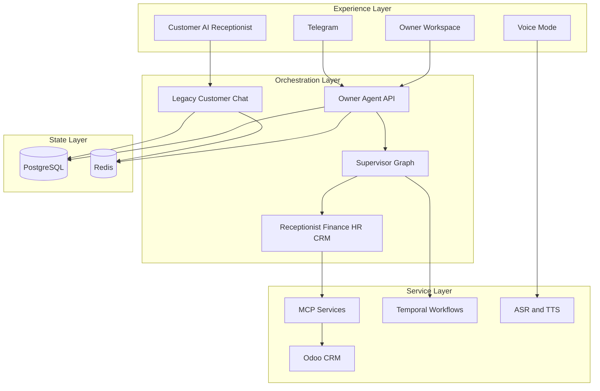
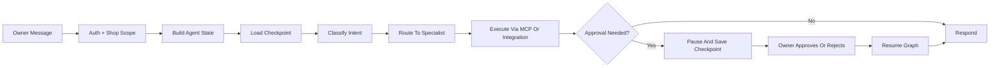
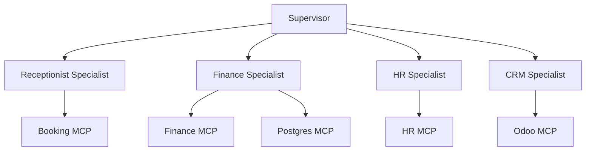
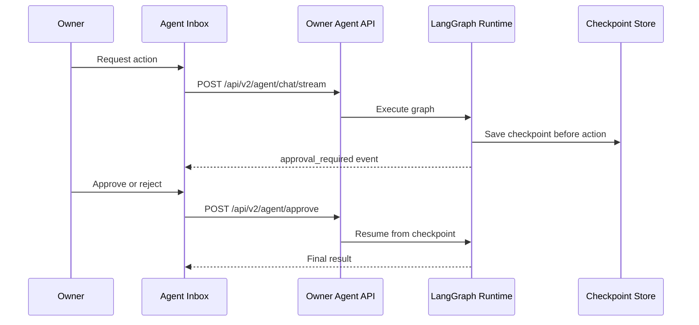
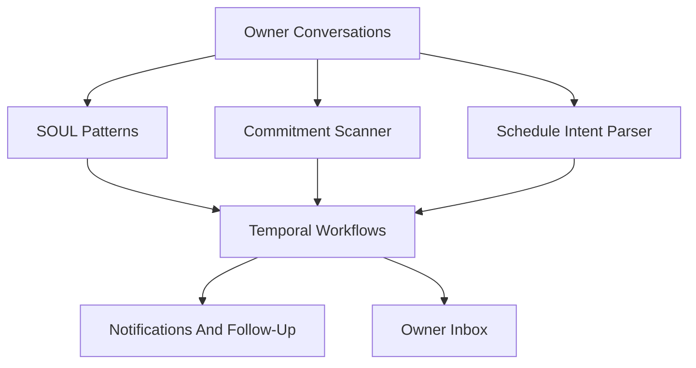
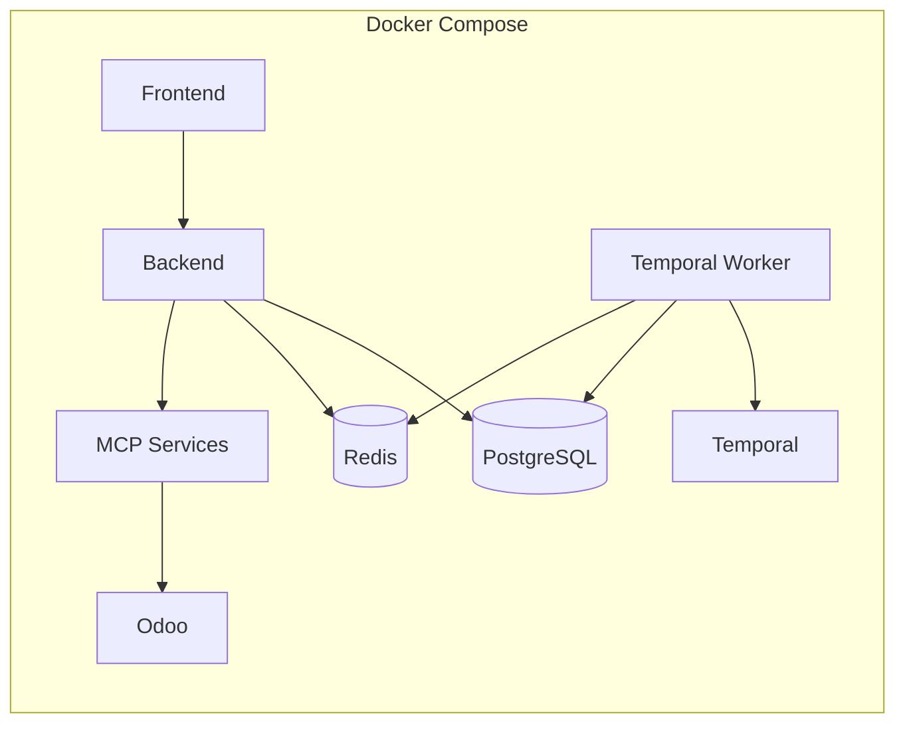
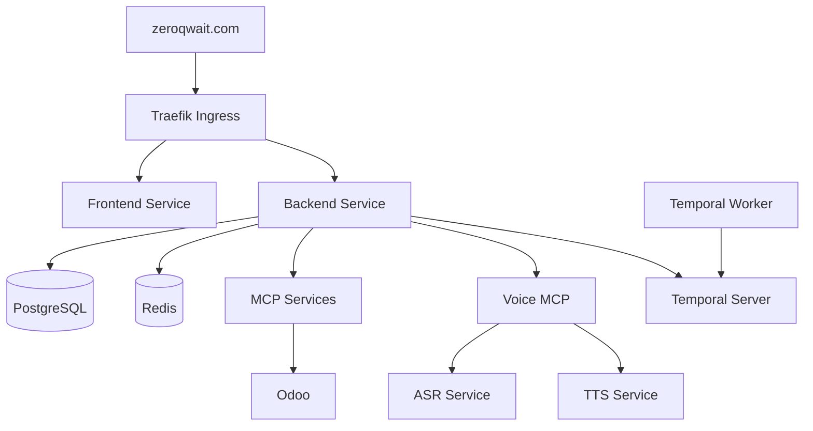
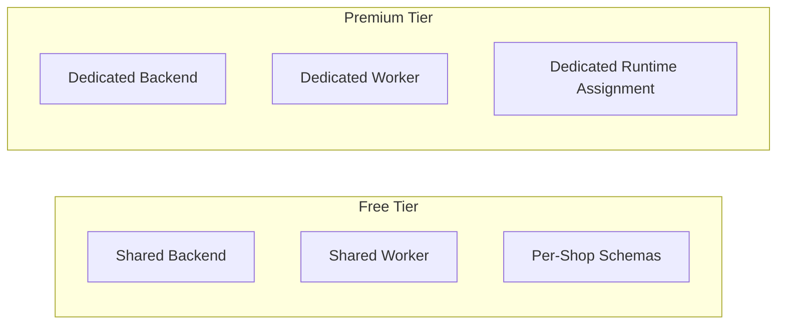

# ZeroQwait Portfolio Diagrams

This page is designed for screenshots, presentations, portfolio posts, and LinkedIn-style architecture storytelling. Each section has one diagram and a short caption so you can use it as a slide deck in markdown form.

## How To Use This Page

- use one section per slide
- take screenshots of the Mermaid diagrams with the caption below each one
- pair the diagram title with a short spoken explanation rather than dense on-slide text

## 1. Product Surface Map



Caption: ZeroQwait is not a single chatbot. It is a multi-surface product with distinct experiences for customers, owners, employees, voice interaction, and messaging channels.

## 2. High-Level Platform Architecture



Caption: The core design separates experience surfaces, orchestration logic, service integrations, and state management. That makes the system easier to evolve and safer to operate.

## 3. Owner-Agent Execution Flow



Caption: The owner experience is a stateful workflow engine, not a stateless prompt-response loop. That is what enables safe execution and resumable approvals.

## 4. Specialist Agent Model



Caption: Each specialist owns a narrower business domain, which keeps execution clearer and avoids turning one prompt into an unmaintainable catch-all system.

## 5. Human-In-The-Loop Control Plane



Caption: Approval is part of the runtime architecture. It is not simulated in the frontend. The system can pause, persist, and resume safely.

## 6. Voice Pipeline

```mermaid
flowchart LR
    Mic[Microphone] --> Recorder[Frontend Recorder]
    Recorder --> ASRRequest[/api/voice/transcribe]
    ASRRequest --> ASR[Whisper ASR]
    ASR --> Agent[Agent Runtime]
    Agent --> TTSRequest[/api/voice/tts]
    TTSRequest --> TTS[Qwen3-TTS Vivian]
    TTS --> Playback[Audio Playback]
```

Caption: Voice is handled through dedicated ASR and TTS services so conversational audio remains reliable and operationally isolated from the main backend.

## 7. Agent Brain Layer



Caption: The platform goes beyond chat by preserving learned patterns, tracking promises, and turning natural-language intent into recurring operational workflows.

## 8. Local Runtime Topology



Caption: Local development uses a single-stack runtime so the whole product can be tested quickly without reproducing the full production footprint.

## 9. Production Deployment Topology



Caption: Production separates application, data, workflow, voice, and integration services so the platform can scale and be operated as a real system rather than a demo stack.

## 10. Tier Isolation Strategy



Caption: The architecture supports a practical growth path: shared infrastructure for free-tier shops and stronger runtime isolation for premium shops, while keeping the same product codebase.

## Suggested Presentation Order

1. Product Surface Map
2. High-Level Platform Architecture
3. Owner-Agent Execution Flow
4. Human-In-The-Loop Control Plane
5. Agent Brain Layer
6. Voice Pipeline
7. Production Deployment Topology
8. Tier Isolation Strategy

## Companion Pages

- [ARCHITECTURE_CASE_STUDY.md](ARCHITECTURE_CASE_STUDY.md)
- [TECHNICAL_ARCHITECTURE.md](TECHNICAL_ARCHITECTURE.md)
