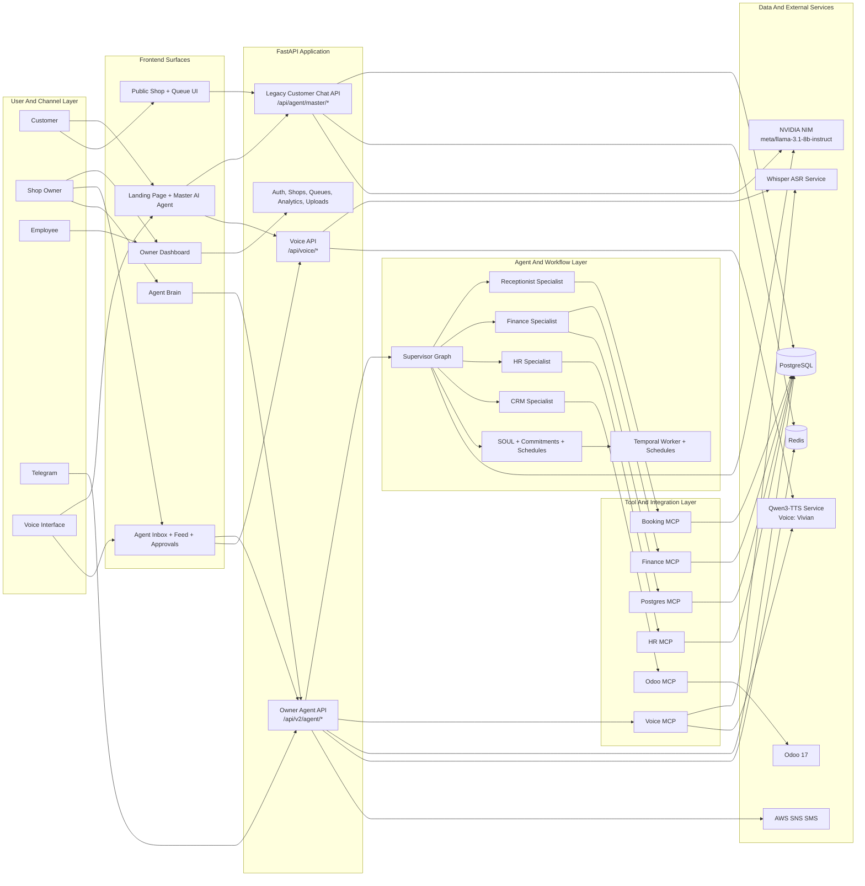
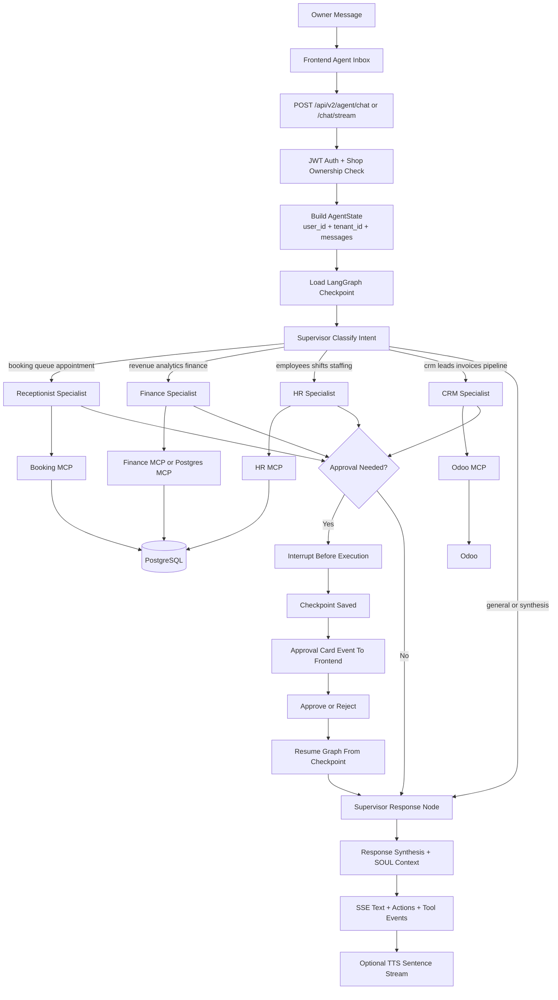
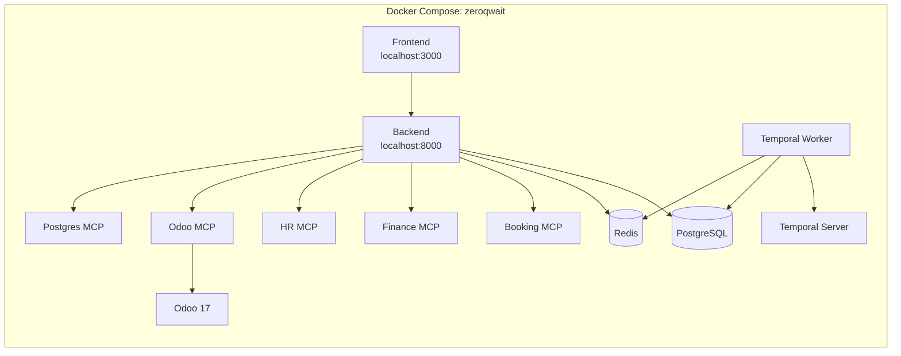
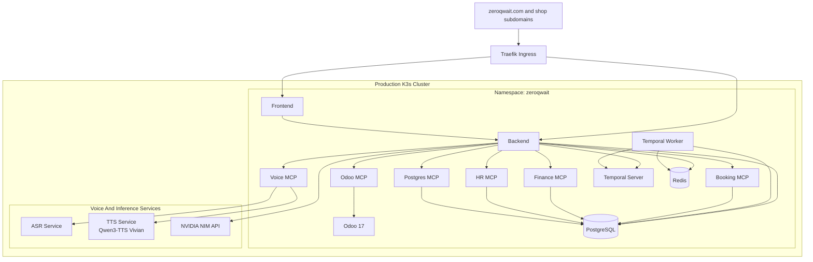

# ZeroQwait Technical Architecture

This document is the professional architecture overview for ZeroQwait. It is written to showcase the system as both a product and an engineering platform: what it does, how it is structured, why the boundaries exist, and what has already been implemented.

## Executive Summary

ZeroQwait is an AI operations platform for service businesses such as barbershops, salons, clinics, and auto shops. The system is designed around one practical idea: the business owner should supervise an AI operations team instead of manually driving every operational workflow.

That product vision is implemented as a layered architecture:

- a customer-facing AI receptionist for discovery, queueing, and voice interactions
- an owner-facing supervisor agent that coordinates specialist agents for bookings, finance, HR, CRM, and operational follow-through
- tool-server boundaries that keep business actions decoupled from agent reasoning
- a persistent memory and workflow layer for approvals, schedules, commitments, and recurring operational work
- multi-tenant runtime isolation so each shop remains scoped, auditable, and safe to operate

## What Has Been Built

### Customer Experience

- Landing-page AI chat with voice and text interaction
- Public shop discovery and service lookup
- Queue joining and status updates
- Real-time voice pipeline using ASR and TTS

### Owner Experience

- LangGraph-based supervisor agent with SSE streaming chat
- Specialist execution across receptionist, finance, HR, and CRM domains
- Human-in-the-Loop approval cards for high-impact actions
- Agent inbox, feed, charts, file attachments, and operational chat
- Agent Brain visual surface for commitments, schedules, and learned business patterns

### Platform Foundations

- PostgreSQL-backed persistent checkpoints for owner-agent workflows
- Redis-backed session and cache surfaces
- Temporal workflows for recurring and deferred operational work
- MCP service boundaries for booking, finance, HR, Odoo CRM, and database tasks
- Telegram integration for outbound notifications and owner interaction
- SMS notification service integrated through AWS SNS

## System Overview

## Execution Model

The owner-facing system is intentionally not a single chatbot. It is a routed execution system with persistence, tool isolation, and approvals.

### Why this matters

- the supervisor decides, but specialists execute in narrower business domains
- tool calls are isolated behind MCP boundaries, which keeps business operations testable and replaceable
- approvals are first-class workflow checkpoints, not ad hoc UI state
- the system remains resumable after pauses, reloads, and long-running operational tasks

## Voice Architecture

Voice is handled as a dedicated pipeline so conversational UX does not contaminate the core business execution model.

```mermaid
flowchart LR
    Mic[Browser Microphone] --> Recorder[Frontend Audio Recorder]
    Recorder --> Transcribe[POST /api/voice/transcribe]
    Transcribe --> ASR[Whisper ASR Service]
    ASR --> AgentInput[Message To Legacy Or Owner Agent]
    AgentInput --> Response[Text Response Stream]
    Response --> TTSRequest[POST /api/voice/tts]
    TTSRequest --> TTS[Qwen3-TTS\nVivian]
    TTS --> Playback[Sentence Audio Playback]
```

Key characteristics:

- ASR and TTS run as dedicated services rather than inside the main backend process
- TTS is standardized on Qwen3-TTS with the Vivian voice to keep brand consistency
- sentence-level streaming keeps voice response latency acceptable while preserving synchronization with the text UI

## Runtime Topology

### Current Local And Non-Prod Topology

The default local and test environment is a single Docker Compose stack.

### Current Production Topology

Production runs on K3s behind Traefik at `https://zeroqwait.com`.

- frontend and backend run as separate workloads
- PostgreSQL and Redis provide the application data plane
- ASR, TTS, MCP services, Temporal, and Odoo are separate operational services
- GitHub Actions and the self-hosted runner drive deployment into the cluster

### Approved Next-Stage Isolation Model

The platform has an approved next-stage runtime model for free-tier shared compute and premium-tier dedicated compute.

| Tier | Data isolation | Compute isolation | Runtime model |
| --- | --- | --- | --- |
| Free | Per-shop schema | Shared backend and worker | Shared multi-tenant operations runtime |
| Premium | Dedicated runtime assignment | Dedicated backend and Temporal worker | Same code, isolated processes per shop |

That model is important architecturally because it scales the product without forking the codebase.

## Core Architecture Decisions

| Decision | Why it exists | Result |
| --- | --- | --- |
| Legacy customer chat kept separate from owner-agent v2 | Preserve public experience while the owner platform matures | Reduced migration risk and cleaner transition path |
| LangGraph for owner agents | Graph execution, checkpoints, approvals, resumability | Reliable multi-step operational workflows |
| MCP servers for business tools | Keep tool execution outside agent prompts and runtime internals | Testable, service-oriented business actions |
| PostgreSQL checkpoints | Persist long-running and approval-gated graph state | Safe pause and resume behavior |
| Temporal for recurring work | Agent commitments and schedules need durable orchestration | Time-based agent behavior without cron sprawl |
| Voice services outside core backend | Keep inference and audio workloads isolated | Better operational clarity and scaling options |
| Tenant scoping at entry and tool boundaries | Prevent cross-shop data leakage | Safer multi-tenant execution model |
| NVIDIA NIM as primary LLM provider | Stable hosted inference for production | Frees local GPU budget for voice workloads |

## Data, State, And Isolation Model

### Persistent Stores

| Store | Purpose |
| --- | --- |
| PostgreSQL | users, shops, queues, services, employees, analytics, agent knowledge, checkpoints, commitments, schedules |
| Redis | session state, caching, rate limits, fast conversational context surfaces |
| Odoo | CRM and ERP records: contacts, leads, invoices, payments |

### Agent State

The core owner-agent state includes:

- conversation messages
- `tenant_id` and `user_id`
- current agent assignment
- pending approval payloads
- tool execution results
- Human-in-the-Loop flags

### Multi-Tenancy Strategy

The platform is designed around shop-scoped isolation.

- owner requests enter through authenticated shop-aware APIs
- the backend injects shop identity into state before graph execution
- tool execution is shop-scoped
- checkpoints are keyed per tenant and user
- approved premium runtime isolation extends the same model without splitting the product codebase

## Major Implemented Subsystems

### 1. Owner Agent Workspace

- streaming chat interface
- specialist routing
- inline actions and approval flows
- chartable outputs for finance and operational summaries

### 2. Agent Brain Layer

- SOUL: persistent business personality and learned operating patterns
- commitments: detection of promises made during chat and later follow-through
- schedules: natural-language recurring task registration and execution through Temporal

### 3. Customer Reception Layer

- landing-page voice and text chat
- service discovery and queue flows
- public booking surfaces during the migration period

### 4. Voice Stack

- browser audio capture
- Whisper ASR transcription
- Qwen3-TTS response playback
- synchronized sentence streaming

### 5. Business Operations Integrations

- Booking MCP for queues, appointments, and wait times
- Finance MCP and Postgres MCP for revenue and operational metrics
- HR MCP for staffing and shifts
- Odoo integration for CRM and ERP workflows

### 6. Notifications And Follow-Through

- WebSocket and feed updates in the owner UI
- Telegram owner messaging integration
- AWS SNS SMS implementation for queue notifications

Note on SMS: the SNS integration is implemented, but real delivery can still be constrained by AWS sandbox and spend-limit settings until the account is promoted appropriately.

## Engineering Breadth Demonstrated By This Platform

This project is not just a chatbot. It demonstrates product and platform architecture across:

- frontend interaction design
- streaming UX
- multi-agent orchestration
- workflow checkpointing
- multi-tenancy and runtime isolation
- external tool and ERP integration
- voice infrastructure
- background orchestration
- deployment automation
- production operations on K3s

## Current State Summary

### Implemented Today

- owner-facing LangGraph supervisor system
- specialist agents and tool routing
- customer-facing legacy AI receptionist transition path
- voice pipeline with dedicated ASR and TTS services
- Temporal-backed brain and scheduling workflows
- CRM integration through Odoo
- Telegram integration
- AWS SNS SMS code path
- local Compose and K3s production deployment flows

### In Transition

- migration of customer-facing chat from legacy `agent_logic.py` to the LangGraph receptionist path
- continued hardening of health checks, routing observability, and production runtime isolation

### Approved Next Stage

- premium dedicated runtime stacks per shop while preserving the same shared codebase and agent framework

## Suggested Reading

- [../README.md](../README.md)
- [../../claude.md](../../claude.md)
- [../setup/ENVIRONMENT_SETUP.md](../setup/ENVIRONMENT_SETUP.md)
- [../testing/TESTING_SUMMARY.md](../testing/TESTING_SUMMARY.md)